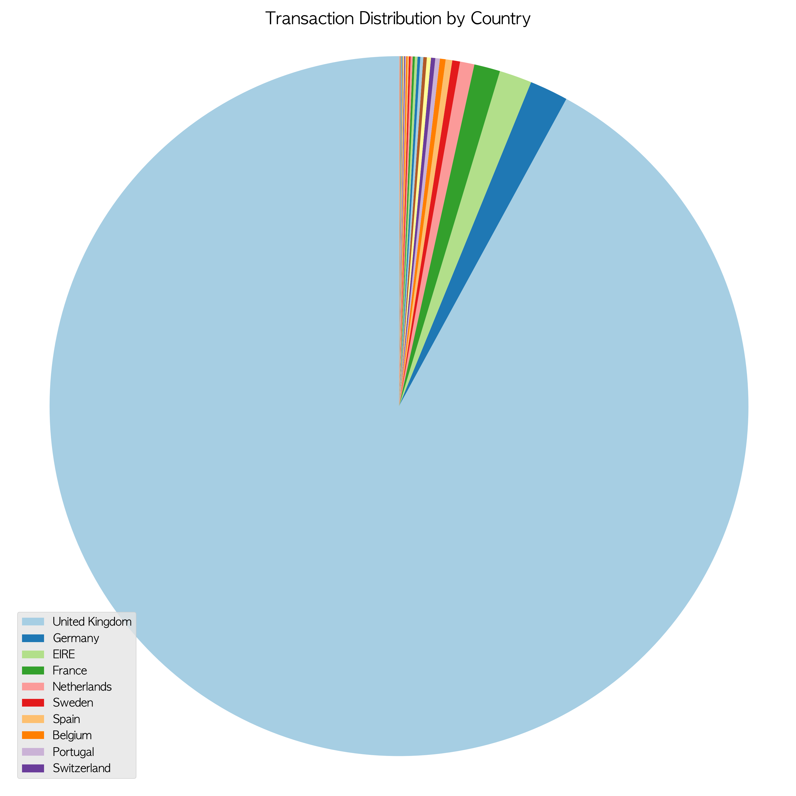
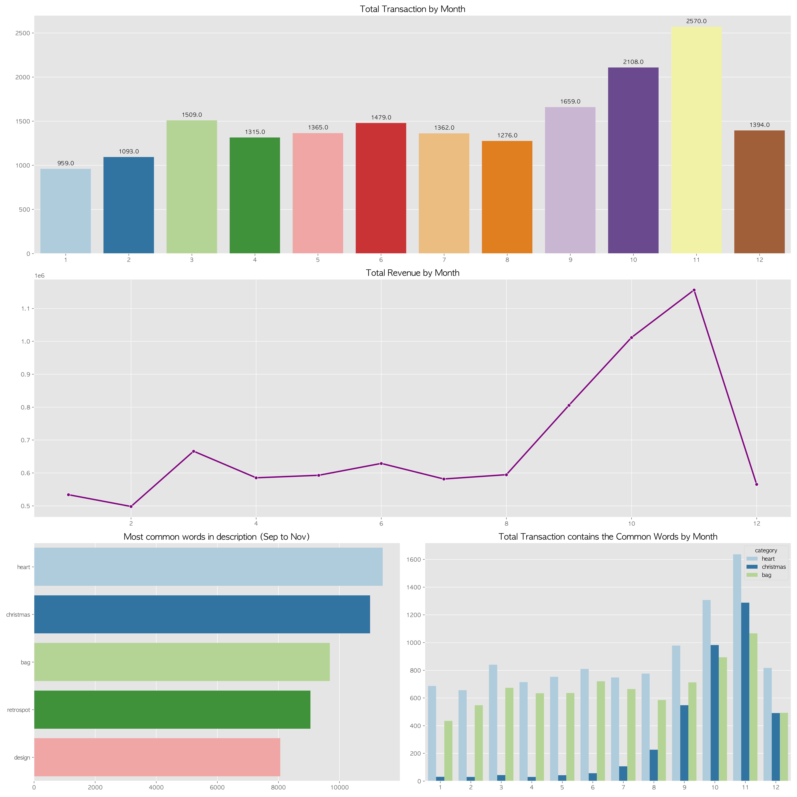
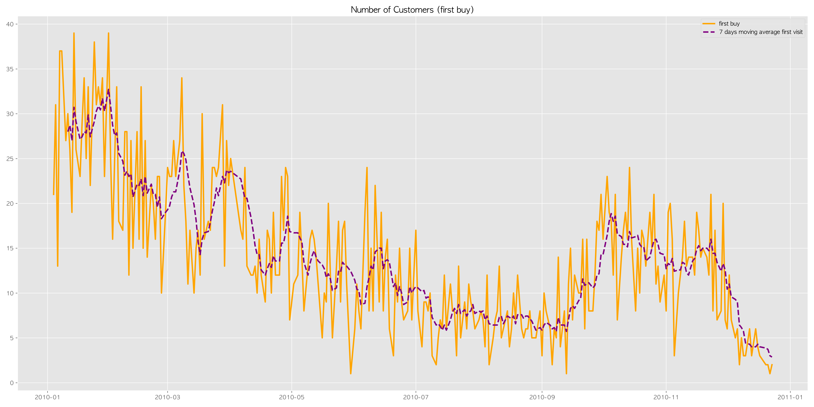
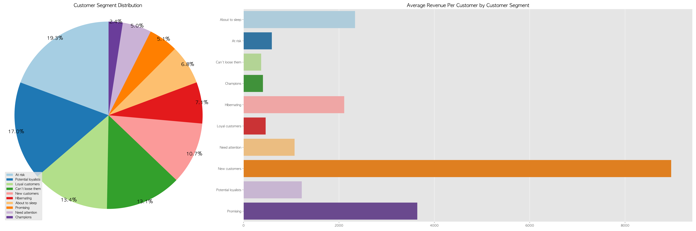
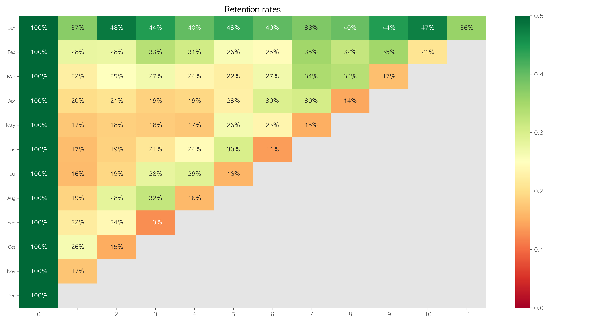

# 목차
- [Introduction](#introduction)
- [Overview of the Data](#overview-of-the-data)
	* [Preprocessing](#preprocessing)
- [Exploratory Data Analysis](#exploratory_data_analysis) 

- [Conclusion](#conclusion)
- [References](#references)


# Introduction
선물 상품을 주로 판매하고 있는 영국의 도매상 2년간의 실제 전자상거래 데이터이다.<br>2009년 12월 1일부터 2011년 12월 9일까지의 거래 내역을 포함하고 있다.</br> **RFM Analysis를 이용하여서 어떻게하면 구매력을 더 높일 수 있을지를 목표**로 데이터 분석을 하였다.<br>캐글 https://www.kaggle.com/mathchi/online-retail-ii-data-set-from-ml-repository 에서 가져왔으며 원출처는 https://archive.ics.uci.edu/ml/datasets/Online+Retail+II 이다.</br>

United Kingdom에서 가장 많이 구매를 하며 9월부터 11월에 가장 많은 구매를 한다.<br>
1월에 첫 구매를 한 고객들의 retention은 유독 좋은 편이며 상대적으로 7월과 8월에는 상대적으로 첫 구매가 적게 일어난다.</br>
전체 고객층에서 new customers가 가장 많은 revenue를 차지하고 있는 고객층이라 중요하다고 여겼고 이들을 충성 고객으로 만들어야 한다.


# Overview of the Data
2009년 12월 1일부터 2011년 12월 9일까지의 데이터 중 정확한 분석을 위해 일년의 데이터가 전부 있는 **2010년 데이터만** 사용하였다.

| index | name | references | 
| --- | --- | --- |
| 1 | InvoiceNo | Invoice number. Nominal. A 6-digit integral number uniquely assigned to each transaction. If this code starts with the letter 'c', it indicates a cancellation. | 
| 2 | StockCode | Product (item) code. Nominal. A 5-digit integral number uniquely assigned to each distinct product. | 
| 3 | Description | Product (item) name. Nominal. |
| 4 | Quantity | The quantities of each product (item) per transaction. Numeric. |
| 5 | InvoiceDate | Invice date and time. Numeric. The day and time when a transaction was generated. |
| 6 | UnitPrice | Unit price. Numeric. Product price per unit in sterling. |
| 7 | CustomerID | Customer number. Nominal. A 5-digit integral number uniquely assigned to each customer. | 
| 8 | Country | Country name. Nominal. The name of the country where a customer resides. |


## Preprocessing
- nan 값 제거
- 'Quantity'가 마이너스인 거래는 취소된 상품이며 취소되면 'InvoiceNo'에 숫자와 함게 맨 앞에 C가 붙게된다. 판매된 거래로만 분석을 하기로 하여 제거하였다.
- 'StockCode'에는 문자로 이루어진 것들이 있으며 이는 정상적인 상품 거래에 대한 내용이 아니기 때문에 제거하였다.
- 'Price'에 0값인 컬럼이 있는데 데이터에 영향을 미치지 않을 것 같으므로 제거하지는 않았다.
- 'Country'에는 'Unspecified'값인 컬럼이 있는데 이또한 데이터에 크게 영향을 미치지 않을 것 같으므로 제거하지 않았다. 

### RFM Analysis
- RFM 분석은 회사 매출에 가장 중요한 인자가 Recency, Frequency, Monetary라 생각하여 이에 따라서 고객을 분류하는 분석 방법이다. 
- RFM에 따라서 유저를 10가지로 나누었다. 분류의 기준 날짜는 가장 마지막 거래가 이루어진 날짜의 다음날인 2011년 12월 10일로 하였다. 

| index | name | references | 
| --- | --- | --- |
| 1 | Champions | Bought recently, buy often and spend the most | 
| 2 | Loyal customers | Buy on a regular basis. Responsive to promotions | 
| 3 | Potential loyalist | Recent customers with average frequency |
| 4 | New customers | Bought most recently, but not often |
| 5 | Promising | Recent shoppers, but haven’t spent much |
| 6 | Needs attention | Above average recency, frequency and monetary values. May not have bought very recently though. |
| 7 | About to sleep | Below average recency and frequency. Will lose them if not reactivated. | 
| 8 | At risk | Some time since they’ve purchased. Need to bring them back! |
| 9 | Can’t loose them | Used to purchase frequently but haven’t returned for a long time. |
| 10 | Hibernating | Last purchase was long back and low number of orders. May be lost. |


``` python
# 기준 날짜 : 2011년 12월 10일 -> 가장 마지막 거래가 이루어진 날짜가 2011년 12월 9일이기 때문
standard_date = dt.datetime(2011, 12, 10)
RFM = data.groupby('Customer ID').agg({'date' : lambda date : (standard_date - date.max()).days,
                                'Invoice' : lambda Invoice : Invoice.nunique(),
                                'total_price' : lambda total_price : total_price.sum()})

RFM = RFM.reset_index()
RFM = RFM.rename(columns = {'date' : 'recency',
                     'Invoice' : 'frequency',
                     'total_price' : 'monetary'})

# RFM Scores
RFM['R'] = pd.qcut(RFM['recency'], 5, labels=[5,4,3,2,1])
# 같은 개수로 나누고 싶은데 중복값이 있을 경우
RFM['F'] = pd.qcut(RFM['frequency'].rank(method="first"), 5, labels=[5,4,3,2,1])
RFM['M'] = pd.qcut(RFM['monetary'], 5, labels=[5,4,3,2,1])

# segment
# R,F 점수 이용
segment_map = {
    r'[1-2][1-2]': 'Hibernating',
    r'[1-2][3-4]': 'At risk',
    r'[1-2]5': 'Can\'t loose them',
    r'3[1-2]': 'About to sleep',
    r'33': 'Need attention',
    r'[3-4][4-5]': 'Loyal customers',
    r'41': 'Promising',
    r'51': 'New customers',
    r'[4-5][2-3]': 'Potential loyalists',
    r'5[4-5]': 'Champions'
}
RFM['segment'] = RFM['R'].astype(str) + RFM['F'].astype(str)
RFM['segment'] = RFM['segment'].replace(segment_map, regex=True)
```

# Exploratory Data Analysiss

자세한 EDA 과정은 블로그에서 볼 수 있다.<br>
https://velog.io/@dataone/Project-E-Commerce-Customer-segmentationRFM-analysis를-이용해서-매출-올리기</br>


# Conclusion

1. 압도적으로 많은 거래가 UK에서 일어나고 있다.<br>한 국가에서 일어나는 거래가 전체 거래의 대부분일 경우 그 국가에 문제가 생기면 전체 사업에 큰 타격을 입을 수 있으므로 다른 국가로 사업을 확장 할 필요가 있다.</br>다른 국가의 구매력을 올리기 위해서 배송비 할인등의 프로모션을 기획할 필요가 있다.


2. 일년 중 가장 많은 거래와 revenue가 발생한 달은 9월부터 11월까지이다. <br>이때는 유독 christmas 관련 상품이 잘 팔리는 것으로 보인다. 이에 따라서 christmas를 겨냥한 holiday 프로모션을 진행하면 좋을 것 같다.</br>(heart와 bag 관련 상품도 이 시기에 판매율이 올라가지만 christmas만큼 가파르게 판매율이 오르지는 않는다.)


3. 첫 구매가 상대적으로 적은 7월과 8월에 대대적으로 프로모션을 기획하여 구매를 일으켜서 고객으로 만들어야한다.


4. 전체 고객층에서 at risk, potential loyal, loyal customers, can't loose them, new customers가 가장 많은 비율을 차지하고 있다.<br>그 중에서도 new customers가 가장 많은 revenue를 차지하고 있는 고객층이기 때문에 new customers를 안정적인 충성 고객으로 만들어야 한다.</br>그러기 위해서는 빠른 시일 내에 다시 구매를 하게 만들어서 전체 구매력을 올려야 한다. 

 
5. 1월에 첫 구매를 한 고객들의 retention은 유독 좋은 편이기 때문에 다가오는 1월에 더 많은 고객들이 첫 구매를 할 수 있게 유도해야 한다.


# References
- https://towardsdatascience.com/automated-customer-segmentation-2f9cec9df4df
- https://towardsdatascience.com/know-your-customers-with-rfm-9f88f09433bc