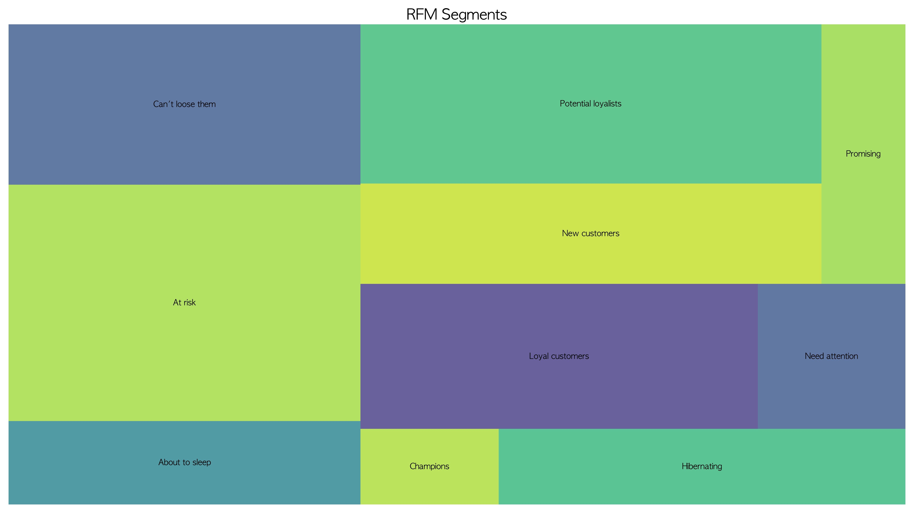
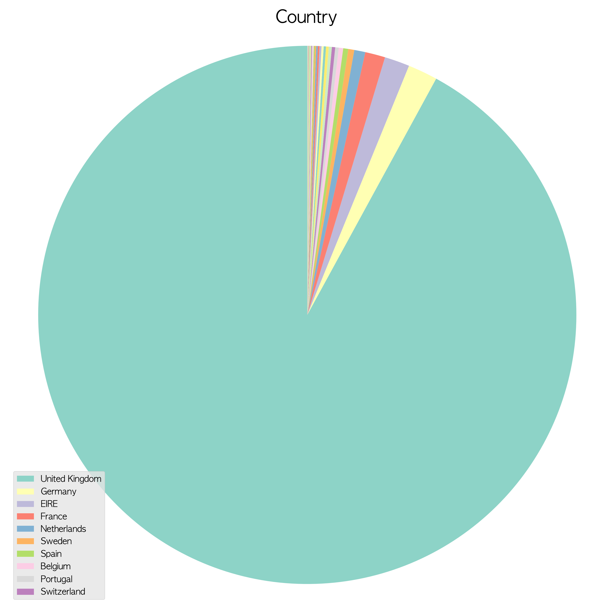
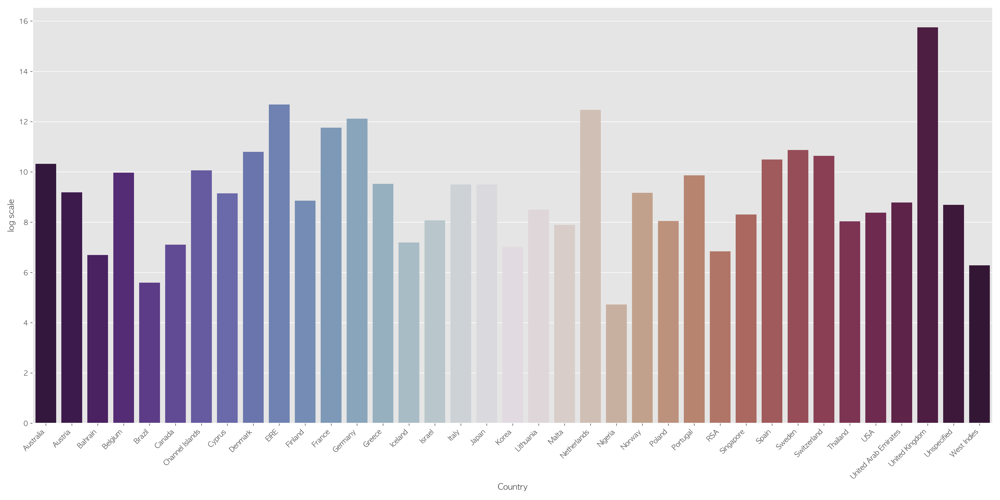

# E-Commerce 

## 목차
- [Introduction](#introduction)
- [Overview of the Data](#overview-of-the-data)
- [Exploratory Data Analysis](#exploratory-data-analysis)
- [Conclusion](#conclusion)


    <!-- * [Preprocess](#preprocess)
<!-- - [Exploratory Data Analysis](#exploratory-data-analysis)
    * [Numerical Data](#numerical-data)
    * [Categorical Data](#categorical-data)
- [Machine Learning Modeling](#machine-learning-modeling)
    * [Testing algorithm](#testing-algorithm)
    * [Feature Importances](#feature-importances)
    * [Learning Curve](#learning-curve)
    * [Confusion Matrix](#confusion-matrix)
- [Retrospect](#retrospect) -->


# Introduction
# Overview of the Data




- RFM에 따라서 유저를 10가지 분류로 나누었다. 


| index | name | references | 
| --- | --- | --- |
| 1 | Champions | Bought recently, buy often and spend the most | 
| 2 | Loyal customers | Buy on a regular basis. Responsive to promotions | 
| 3 | Potential loyalist | Recent customers with average frequency |
| 4 | New customers | Bought most recently, but not often |
| 5 | Promising | Recent shoppers, but haven’t spent much |
| 6 | Needs attention | Above average recency, frequency and monetary values. May not have bought very recently though. |
| 7 | About to sleep | Below average recency and frequency. Will lose them if not reactivated. | 
| 8 | At risk | Some time since they’ve purchased. Need to bring them back! |
| 9 | Can’t loose them | Used to purchase frequently but haven’t returned for a long time. |
| 10 | Hibernating | Last purchase was long back and low number of orders. May be lost. |


``` python
# 기준 날짜 : 2011년 12월 10일 -> 가장 마지막 거래가 이루어진 날짜가 2011년 12월 9일이기 때문
standard_date = dt.datetime(2011, 12, 10)
RFM = data.groupby('Customer ID').agg({'date' : lambda date : (standard_date - date.max()).days,
                                'Invoice' : lambda Invoice : Invoice.nunique(),
                                'total_price' : lambda total_price : total_price.sum()})

RFM = RFM.reset_index()
RFM = RFM.rename(columns = {'date' : 'recency',
                     'Invoice' : 'frequency',
                     'total_price' : 'monetary'})

# RFM Scores
RFM['R'] = pd.qcut(RFM['recency'], 5, labels=[5,4,3,2,1])
# 같은 개수로 나누고 싶은데 중복값이 있을 경우
RFM['F'] = pd.qcut(RFM['frequency'].rank(method="first"), 5, labels=[5,4,3,2,1])
RFM['M'] = pd.qcut(RFM['monetary'], 5, labels=[5,4,3,2,1])

# segment
# R,F 점수 이용
segment_map = {
    r'[1-2][1-2]': 'Hibernating',
    r'[1-2][3-4]': 'At risk',
    r'[1-2]5': 'Can\'t loose them',
    r'3[1-2]': 'About to sleep',
    r'33': 'Need attention',
    r'[3-4][4-5]': 'Loyal customers',
    r'41': 'Promising',
    r'51': 'New customers',
    r'[4-5][2-3]': 'Potential loyalists',
    r'5[4-5]': 'Champions'
}
RFM['segment'] = RFM['R'].astype(str) + RFM['F'].astype(str)
RFM['segment'] = RFM['segment'].replace(segment_map, regex=True)
```

# Exploratory Data Analysis

 (지도 그래프로 교체)


- 전체 거래에서 가장 많은 국가는 다섯 가지는 Unitied Kingdom, Germany, France, EIRE, Netherlands. 
    - 모든 RFM customer segment에서 첫번째는 Unitied Kingdom 이다. 특이하게 Hibernating는 전체 다섯 국가 중에 없는 Greece가 두번째로 거래가 많은 국가. 
    - (가장 많은 거래한 사람과 segment)





- 전체 Revenue가 가장 많은 국가는 Unitied Kingdom 이지만 유저당 평균 Revenue는 EIRE이다.
    - 전체의 유저당 평균 Revenue보다 EIRE의 유저당 평균 Revenue가 훨씬 높다.


- 가장 많은 거래가 일어난 달은 2011년 11월이다. 9월부터 11월에 거래가 많은 것을 알 수 있다. 2009년을 제외하고 토요일에는 거래가 일어나지 않는다. 8시 부터 거래가 눈에 띄게 일어나기 시작하면서 점점 많아지다가 12시에 가장 많은 거래가 일어난다. 12시가 지나면 조금씩 줄어들다가 20시 이후에는 거래가 이루어지지 않는다. 


.png)
- 제품에 가장 많이 등장한 단어 열가지는 bag, heart, set, design, retrospot, vintage, box, christmas, metal, pink 이다.
    - 모든 RFM customer segment에서 제품에 가장 많이 등장한 단어 다섯가지 공통적으로 bag, heart, set이 있고 Loyal customeers, Potetial loyalists, Champions에서 공통적으로 christmas가 보인다. 이는 christmas가 포함된 제품의 거래는 10월과 11월에 많이 이루어지는데 이와 같은 segment 에서도 10월과 11월 구매가 활발하게 일어났다는 것을 보여주고 있다. 


# Conclusion

To increase the market sales :
- 9월 부터 11월까지 가장 거래가 많은데 이 시기에는 충성고객층(Loyal customeers, Potetial loyalists, Champions)의 christmas 관련 상품이 많이 구매하므로 이 고객층 대상으로 christmas 관련 프로모션 기획하여 세일즈를 올릴 수 있다. 
- 토요일과 20시 부터 6시 전까지는 거래가 일어나지 않기 때문에 이 기간을
- 대부분의 거래가 영국에서 이루어지기 때문에 다른 나라에서의 세일즈를 올리기 위해서 배송비 할인 프로모션 등을 기획할 수 있다.